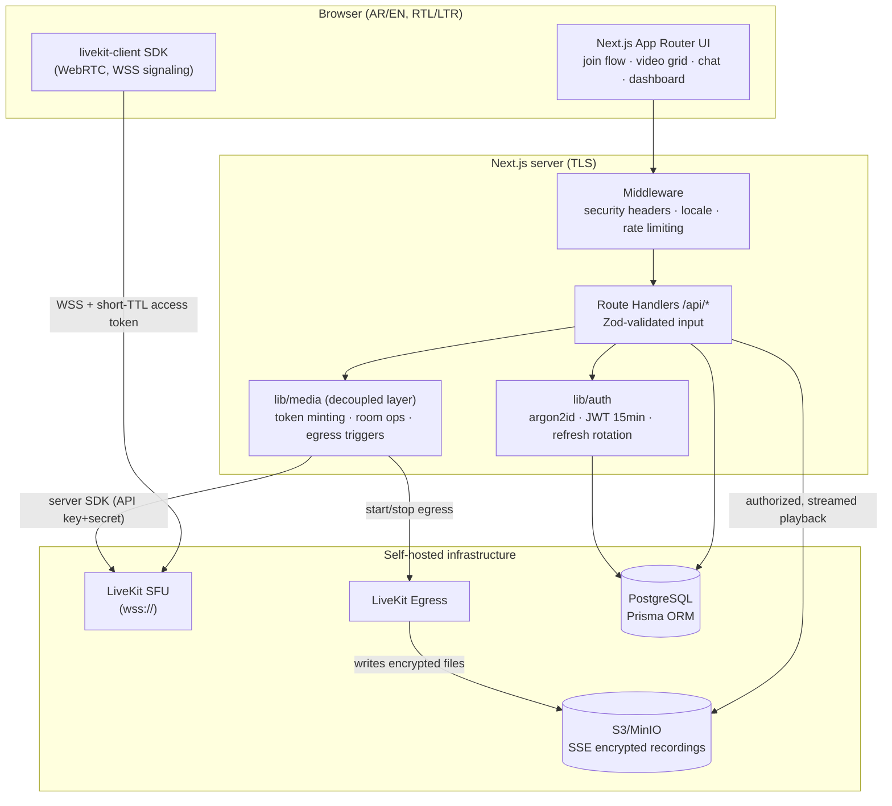

# QIMAM Meet — Architecture

> Living document. Updated at every build step.

## 1. Backend choice: Next.js Route Handlers (not NestJS — for now)

For the MVP, auth, token minting, and room CRUD live in Next.js Route Handlers rather than a separate NestJS service. Rationale:

- **Smaller attack surface at MVP scale.** One deployable, one TLS terminator, one set of headers/middleware to harden. A second service adds an internal network boundary to secure before it adds value.
- **Server-only secrets are already enforceable.** Route Handlers run exclusively server-side; LiveKit secrets never enter the client bundle.
- **Clean seam for later extraction.** All media/token logic is isolated in `src/lib/media/` (see §3) behind plain TypeScript interfaces. If/when CityMind integration or org-wide SSO demands isolated auth infrastructure, that folder plus `src/lib/auth/` lifts into a NestJS service without touching UI code.

Trigger to revisit: >1 consumer of the media layer (e.g. CityMind broadcast mode), or a compliance requirement for physically separated auth services.

## 2. System diagram



## 3. Layering — CityMind decoupling rule

```
src/
  lib/
    media/     ← "room/broadcast" layer. Knows LiveKit, tokens, grants, egress.
                 NO knowledge of meetings, users, or business rules.
                 Future CityMind live-operations broadcast mode reuses this as-is.
    auth/      ← identity, sessions, roles. No LiveKit knowledge.
    audit/     ← append-only audit logging.
  app/
    [locale]/  ← UI (meeting business logic lives here + in /api route handlers)
    api/       ← Route Handlers: compose auth + media + db. Thin.
```

Rule: `lib/media` accepts primitives (room name, identity, grant set, TTL) and returns tokens/handles. Meeting semantics (who may host, invite policy, recording policy) are decided by the caller. This is the seam that lets a broadcast mode reuse the media layer without refactoring.

## 4. Data flow — typical meeting session

1. **Login:** POST `/api/auth/login` → argon2id verify → 15-min access JWT + rotating refresh token (httpOnly/secure/sameSite=strict cookies). Audit: `USER_LOGIN`.
2. **Create room (HOST/ADMIN only):** POST `/api/rooms` → Zod validation → role check → `Room` row → signed, time-limited invite link (HMAC, `INVITE_LINK_SECRET`). Audit: `ROOM_CREATED`.
3. **Join:** invitee opens link → signature + expiry verified server-side → auth session or invite-grant established → device preview page (local `getUserMedia` only, nothing leaves the browser).
4. **Token mint:** POST `/api/rooms/:id/token` → server mints LiveKit access token with least-privilege grants for the user's role, TTL ≤ 4h. Secret never leaves the server. Audit: `ROOM_JOINED`.
5. **Media:** client connects `wss://` to LiveKit SFU. Chat rides LiveKit data channels (no server persistence in MVP).
6. **Recording (HOST):** POST `/api/rooms/:id/recording` → role check → Egress API start/stop → `Recording` row (S3 object key reference only). Audit: `RECORDING_STARTED/STOPPED`.
7. **Playback:** GET `/api/recordings/:id` → per-request authorization → short-lived presigned URL or streamed proxy. Never a public/static URL.
8. **Leave/end:** participant departure recorded (`ROOM_LEFT`); meeting end timestamps the `Meeting` row.

## 5. Security model summary

| Layer | Control |
|---|---|
| Transport | TLS/HTTPS + WSS only; HSTS via middleware; no plaintext fallback |
| Headers | CSP, X-Frame-Options DENY, nosniff, Referrer-Policy, Permissions-Policy |
| Identity | argon2id hashes; 15-min access JWT; refresh rotation in httpOnly/secure/strict cookies |
| Media tokens | Server-minted only, least-privilege grants per role, TTL ≤ 4h, re-minted on reconnect |
| Room access | Authenticated session OR signed time-limited invite link; creation gated to HOST/ADMIN |
| Input | Zod schemas on every API boundary before DB/LiveKit calls |
| Data at rest | Recordings SSE-encrypted in S3/MinIO; access-checked retrieval endpoint |
| Database | Prisma parameterized queries only; least-privilege DB role |
| Audit | Dedicated `AuditLog` table: room create/join/leave, recording start/stop (timestamp + user ID, no payloads) |

Full rationale for each decision: `SECURITY.md`.

## 6. Recording retention & legal hold

> Flagged for future compliance review — revisit before onboarding any government client with its own records-management schedule.

`Recording` rows carry three lifecycle fields:

- **`retentionExpiresAt`** — when the recording becomes eligible for scheduled deletion. `null` means retain indefinitely (MVP default until an org-level retention policy is set). A future scheduled job deletes eligible S3 objects; the MVP has no auto-deletion.
- **`legalHold`** — overrides *everything*: a recording under legal hold is excluded from retention sweeps **and** from manual deletion requests until the hold is lifted (ADMIN action, audit-logged).
- **`deletedAt`** — deletions are **soft**: the S3 object is removed, but the DB row persists with `deletedAt` set. This preserves the metadata/audit trail (who recorded what, when, and when it was deleted) for compliance reconstruction. Rows are never hard-deleted by the application.

Deletion precedence: `legalHold` > manual deletion request > `retentionExpiresAt` sweep.

## 7. Status log

- **Step 1 (done):** Scaffold — Next.js 14 App Router, TS strict, Tailwind design tokens, shadcn/ui config, next-intl (ar default/RTL), security-header middleware, docs skeleton.
- **Step 2 (done):** Schema approved with additions (RefreshToken table, guest/invite/device fields on MeetingParticipant, retention/legal-hold/soft-delete on Recording). Initial migration generated at `prisma/migrations/20260702000000_init/` (created offline via `prisma migrate diff`; apply with `prisma migrate deploy` once a Postgres instance is available — it will be recorded in `_prisma_migrations` normally).
- **Step 3 (done):** Auth — argon2id hashing (`lib/auth/passwords.ts`), 15-min access JWT + family-scoped refresh rotation (`lib/auth/tokens.ts`), strict httpOnly cookies (`lib/auth/cookies.ts`), IP+email rate limiting (`lib/auth/rate-limit.ts`), Zod schemas, audit logging (`lib/audit/log.ts`). Routes: `/api/auth/{signup,login,refresh,logout,me}`.
- **Step 4 (done):** Join/room UI on MOCK media. The media contract lives in `lib/media/types.ts` (`MediaRoomClient`, `MediaParticipant`, `RoomSnapshot`); `MockMediaClient` simulates connection, speakers, a late joiner, and chat. UI components (`components/meeting/*`) depend only on the contract.
- **Step 5 (done):** Real LiveKit behind the same contract.
  - **Provider switch:** `lib/media/provider.ts` resolves `mock | livekit` server-side (fails safe to mock if credentials are missing). The room page passes the resolved provider to `MeetingRoom`; `lib/media/use-media-room.ts` selects the client, fetches a token for LiveKit, and exposes `phase` (`connecting`/`ready`/`error`) with a mock fallback.
  - **`LiveKitMediaClient`** (`lib/media/livekit-media-client.ts`) is the ONLY module importing `livekit-client`; it implements `MediaRoomClient` (connect, participant mapping, mic/camera/screen toggles, active-speaker, connection state, data-channel chat). This is the CityMind seam realized: swapping the client required zero UI changes.
  - **Server token endpoint** `POST /api/livekit/token` (`lib/media/livekit-server.ts`): Zod-validated, auth-or-guest, server-resolved role, least-privilege grants, TTL ≤ 4h, non-guessable identity. Secret stays server-side.
  - **Invites:** HMAC invite tokens (`lib/media/invite.ts`) verified server-side; guest joins exchange the invite for an httpOnly guest-grant cookie (`POST /api/livekit/guest`) so the raw token never enters the room URL.
  - **CSP** `connect-src` pinned to the exact `LIVEKIT_URL` origin.
  - **Deferred to Step 6:** server-side host moderation (RoomService), recording (Egress), and DB-backed room/invite persistence — host actions are optimistic-local in the meantime.
